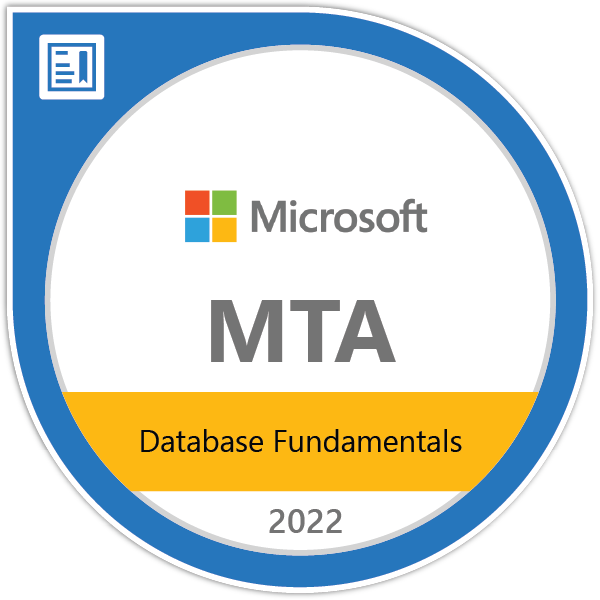

<h2 align="center">I'm Pedro Lustosa! :speech_balloon:</h2>

  
  
   

## About Me

📫 **How to find me:** 

 

  "Graduated in Bachelor in Information System and technical course in Computer Maintenance.
   He has several experiences in the technology area, such as micro support and maintenance, DBA, IT governance and as a Full-Stack Developer. And today I am focused on my career as a Full-Stack and Mobile      Developer. In addition to these hit goals, I aim to improve my English and in the future start Graduate/Master/Doctorate with a focus on artificial intelligence."

:zap: **In these last days, I am improving my knowledge in:**

### Skills

  
  
  
  
  
  
  
  
  
  
  

### Tools

  
  
  
  
  
  
  
  
  
  
  
  
  
  

### Badges

  
CertiProf

    
    
    
    
    

  
Microsoft

    
    
    
    
    
    
    
    
    
    

