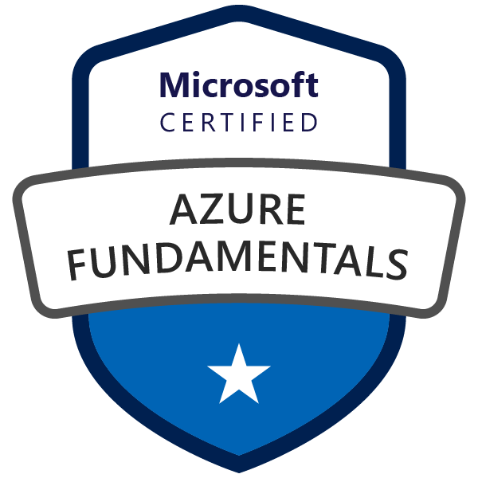
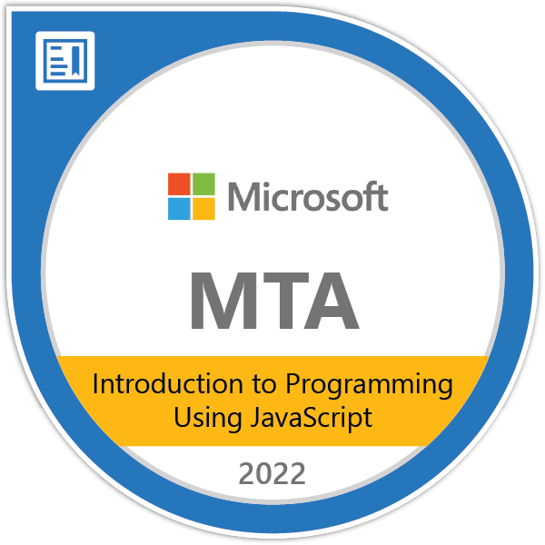
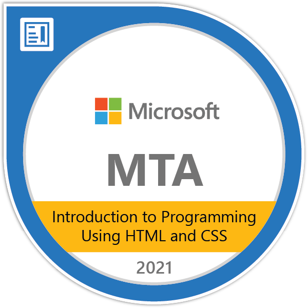
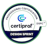

<div align="center">

<h1>👋 Hi, I'm Pedro Lustosa</h1>

<p>
  <strong>Full Stack Developer</strong> | .NET | Angular | React | Cloud Solutions
</p>

<p>
  <a href="https://www.linkedin.com/in/pedro-henrique-lustosa-e-silva-29b827144">
    
  </a>
  <a href="mailto:pedroeternalss@gmail.com">
    
  </a>
  <a href="https://www.credly.com/users/pedrolustosaengineer">
    
  </a>
</p>

<p>
  Building scalable, resilient systems with a strong focus on clean architecture, performance, and team collaboration.
</p>

<p>
  
</p>

</div>

---

## 🧠 About Me

<div align="center">
  <table>
    <tr>
      <td align="left" width="380px">
        <strong>Who I am</strong>
        <ul>
          <li>Full Stack Developer with experience in enterprise .NET and modern frontend frameworks.</li>
          <li>Specialized in cloud-native solutions, high-performance APIs and responsive user interfaces.</li>
          <li>Driven by clean code, architecture patterns and continuous improvement.</li>
        </ul>
      </td>
      <td align="left" width="380px">
        <strong>What I bring</strong>
        <ul>
          <li>Backend architecture, API design and distributed systems.</li>
          <li>Angular / React interfaces with TypeScript and modern UX patterns.</li>
          <li>Azure, AWS, Docker, CI/CD and DevOps collaboration.</li>
        </ul>
      </td>
    </tr>
  </table>
</div>

```csharp
var developer = new FullStackDeveloper
{
    Name = "Pedro Lustosa",
    Focus = ["Performance", "Scalability", "Clean Code"],
    Stack = ["C#", ".NET", "Python", "Angular", "React", "TypeScript", "JavaScript"],
    Cloud = ["Azure", "AWS"],
    Practices = ["DDD", "Clean Architecture", "CQRS", "Design Patterns"],
    Methodologies = ["Agile", "Scrum", "Kanban"]
};
```

---

## 🚀 Career Snapshot

<div align="center">
  <table>
    <tr>
      <td align="center" width="250px">
        <h3>Experience</h3>
        <p>Backend systems, frontend solutions, and cloud architectures.</p>
      </td>
      <td align="center" width="250px">
        <h3>Delivery</h3>
        <p>Clean code, scalable design and maintainable projects.</p>
      </td>
      <td align="center" width="250px">
        <h3>Collaboration</h3>
        <p>Cross-functional teams, Agile ceremonies and mentoring.</p>
      </td>
    </tr>
  </table>
</div>

---

## 📊 GitHub Insights

<div align="center">
  
  
</div>

---

## 🛠️ Tech Stack

### 💻 Languages
<p align="center">
  
  
  
  
  
  
  
</p>

### 🧩 Frameworks & Libraries
<p align="center">
  
  
  
  
</p>

### 🗄️ Databases & Messaging
<p align="center">
  
  
  
  
  
</p>

### ☁️ Cloud & Tools
<p align="center">
  
  
  
  
  
  
</p>

---

## 🎓 Education

- 🎓 Bachelor in Information Systems
- 🤖 Postgraduate in Artificial Intelligence
- 📊 Postgraduate in Data Science & Analytics
- 🔧 Technical Degree in Computer Maintenance

> 💭 *"The more I learn, the more I realize how much I don't know."* — Albert Einstein

---

## 🏆 Certifications

<details>
  <summary><b>📘 Microsoft Certifications</b></summary>
  <br />
  <p align="center">
    
    
    
    
    
    
    
    
    
    
  </p>
</details>

<details>
  <summary><b>📗 CertiProf Certifications</b></summary>
  <br />
  <p align="center">
    
    
    
    
    
    
  </p>
</details>
