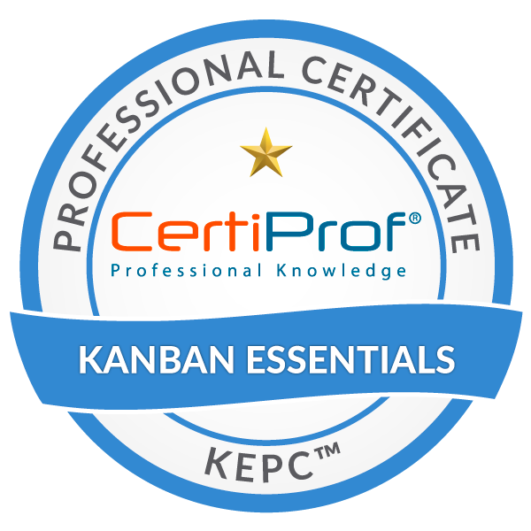
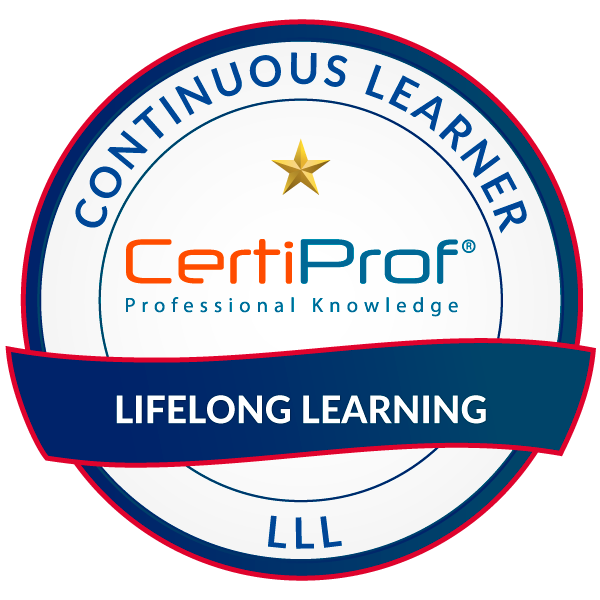

<div align="center">

# Pedro Lustosa

[](https://www.linkedin.com/in/pedro-henrique-lustosa-e-silva-29b827144)
[](mailto:pedroeternalss@gmail.com)
[](https://www.credly.com/users/pedrolustosaengineer)

**Full Stack Developer | .NET & Angular Specialist | Cloud Solutions**

<p>
  <a href="https://github.com/Pedrolustosa/github-readme-stats">
    
  </a>
  <a href="https://github.com/Pedrolustosa/github-readme-stats">
    
  </a> 
</p>

</div>

## 👨‍💻 About Me

```csharp
var developer = new FullStackDeveloper
{
    Name = "Pedro Lustosa",
    Focus = ["Performance", "Scalability", "Clean Code"],
    PrimaryStack = ["C#", ".NET", "Angular", "SQL Server", "Azure"],
    Methodologies = ["Agile", "SCRUM", "Kanban"]
};
```

I'm a Full Stack Developer passionate about creating efficient, scalable solutions that solve real-world problems. With expertise in .NET and Angular ecosystems, I build applications that balance technical excellence with user experience. I thrive in collaborative environments and believe that clear communication is key to successful project delivery.

## 🎓 Education & Continuous Learning

- 🎓 Bachelor in Information Systems
- 🔧 Technical Course in Computer Maintenance
- 🤖 Postgraduate in Artificial Intelligence - *In Progress*
- 📊 Postgraduate in Data Science and Analytics - *In Progress*

> "The more I learn, the more I realize how much I don't know." — Albert Einstein

## 🛠️ Tech Stack

<details open>
<summary><b>💻 Languages</b></summary>
<br>
<p align="center">
  
  
  
  
  
  
  
</p>
</details>

<details open>
<summary><b>🗄️ Databases & Messaging</b></summary>
<br>
<p align="center">
  
  
  
  
  
</p>
</details>

<details open>
<summary><b>🧩 Frameworks & Libraries</b></summary>
<br>
<p align="center">
  
  
  
  
  
  
  
</p>
</details>

<details open>
<summary><b>🔧 Tools & Cloud</b></summary>
<br>
<p align="center">
  
  
  
  
  
</p>
</details>

## 🏆 Certifications

<details>
  <summary><b>Microsoft Certifications</b> (10)</summary>
  <br>
  <p align="center">
    
    
    
    
    
  </p>
  <p align="center">
    
    
    
    
    
  </p>
</details>

<details>
  <summary><b>CertiProf Certifications</b> (6)</summary>
  <br>
  <p align="center">
    
    
    
    
    
    
  </p>
</details>

## 📊 GitHub Stats

<p align="center">
  
</p>

---

<div align="center">

### 💬 Let's Connect!

[](https://www.linkedin.com/in/pedro-henrique-lustosa-e-silva-29b827144)
[](mailto:pedroeternalss@gmail.com)
[](https://www.credly.com/users/pedrolustosaengineer)
[](https://www.buymeacoffee.com/pedrolustosa)


</div>
