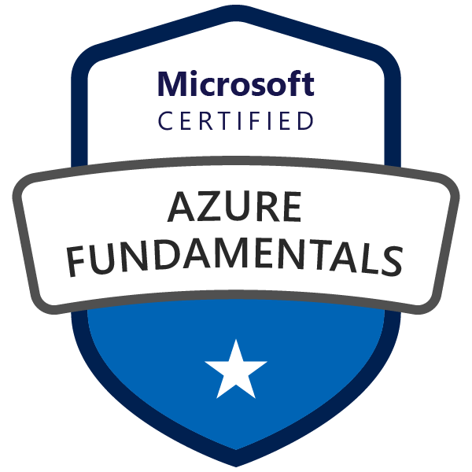

<h2 align="center">Hello, I'm Pedro Lustosa! :speech_balloon:</h2>

  
   

## About Me
📫 **How to find me:** 

 

  "Graduated in Bachelor in Information System and technical course in Computer Maintenance.
   I have several experiences in the technology area, such as micro support and maintenance, DBA, IT governance, and as a Full-Stack Developer. Currently, I am focused on my career as a Full-Stack and Mobile Developer. In addition to these goals, 
   I aim to improve my English and in the future start a Postgraduate/Master/Ph.D. with a focus on artificial intelligence."

### Education
- Bachelor in Information Systems
- Technical Course in Computer Maintenance
- Postgraduate in Artificial Intelligence - In Progress
- Postgraduate in Data Science and Analytics - In Progress

:zap: **In these last days, I am improving my knowledge in:**
### Languages

  
  
  
  
  
  
  

### Databases

  
  
  
  
  

### Frameworks

  
  
  
  
  
  
  

### Support Tools

  
  
  
  
  

### Certifications

  
CertiProf

    
    
    
    
    

  
Microsoft

    
    
    
    
    
    
    
    
    
    

