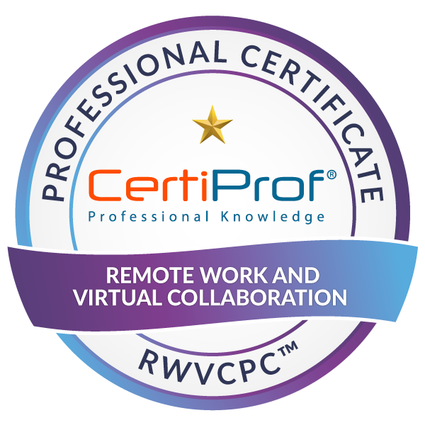

<h2 align="center">I'm Pedro Lustosa! :speech_balloon:</h2>

  
  
  

## Hey Comrades 👋

* 📫 How to find me: 
 

  "I am Pedro Lustosa, I am studying Information System and I am currently doing the 7th period. I have already had contact with several areas of information technology because of my curiosity. But, of all areas my biggest focus is Development, and I study to be a Dev. FullStack and to be able to do my master's degree in Artificial Intelligence and I want to learn English, because I still have the basics and I want to work in other countries"

:zap: In these last days I am improving my knowledge in:
<ul>
  <li>:books: Skills:</li>
   
  

    
  

  
  <li>:toolbox: Tools:</li>
   
  

    
  

  <li>:1st_place_medal: Badges:</li>
  

    

      
CertiProf

      
      
      
      
      
    

    

      
Microsoft

      
      
      
      
    

  

</ul>

